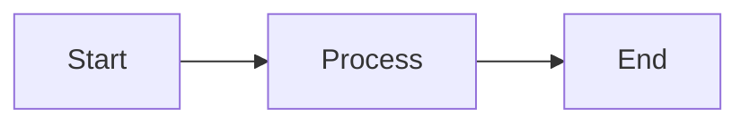

# Docusaurus Template

Minimal Docusaurus template with multi-instance docs.

## Quick Start

```bash
bun install
bun run start
```

## Project Structure

```
docs.config.ts       ← Single source of truth for docs sections
sidebars.ts          ← Auto-generated from docs.config.ts
docusaurus.config.ts ← Site config (imports docs.config.ts)

content/
  docs/    → Main docs (/)
  api/     → API reference (/api)
  guides/  → Guides (/guides)
```

## Add a New Docs Section

1. Add entry in `docs.config.ts`:

```ts
export const docs: DocsInstance[] = [
  { id: 'docs', path: 'content/docs', route: '/', label: 'Docs' },
  { id: 'api', path: 'content/api', route: '/api', label: 'API' },
  { id: 'guides', path: 'content/guides', route: '/guides', label: 'Guides' },
  { id: 'sdk', path: '../sdk-repo/docs', route: '/sdk', label: 'SDK' },  // ← add
];
```

2. Create content (if local):

```bash
mkdir -p content/sdk
echo "# SDK Documentation" > content/sdk/intro.md
```

Done. Sidebar + navbar appear automatically.

## External Docs (from other repos)

Include docs from external repositories:

```ts
// docs.config.ts
{ id: 'ingestor', path: '../../other-org/other-repo/docs', route: '/ingestor', label: 'Ingestor' },
```

**Local development:** Clone the external repo and use relative path.

**CI:** Add checkout step in workflow (see deploy.yml).

> **Note:** Symlinks are [not supported by Docusaurus](https://github.com/facebook/docusaurus/issues/6257) and will cause crashes. Use relative or absolute paths instead.

## Deploy to GitHub Pages

1. Repository Settings → Pages → Source: "GitHub Actions"
2. Push to main

Site URL: `https://{owner}.github.io/{repo}/`

## Mermaid Diagrams

Mermaid is enabled by default. Use fenced code blocks in markdown:

````markdown

````

Supported diagram types: flowchart, sequence, state, class, gantt, pie, ER, and more. See [Mermaid docs](https://mermaid.js.org/) for syntax.

Configure themes in `docusaurus.config.ts`:

```ts
themeConfig: {
  mermaid: {
    theme: { light: 'neutral', dark: 'forest' },
  },
},
```

## Print / PDF Export

Print styles are included in `src/css/custom.css` (`@media print`). When printing or exporting to PDF:

- Navbar, sidebar, breadcrumbs, TOC, and footer are hidden
- Content expands to full page width
- Tables use full width with repeated headers
- Page breaks avoid splitting tables, code blocks, and admonitions

**Browser print:** `Cmd+P` / `Ctrl+P` works out of the box.

**Automated PDF export** with [Playwright](https://playwright.dev/):

```js
const { chromium } = require('playwright');
const browser = await chromium.launch();
const page = await browser.newPage();
await page.goto('http://localhost:3000/my-doc', { waitUntil: 'networkidle' });
await page.pdf({ path: 'output.pdf', format: 'A4', printBackground: true,
  margin: { top: '20mm', bottom: '20mm', left: '18mm', right: '18mm' } });
await browser.close();
```

## Update Docusaurus

```bash
# Check for updates
bun outdated

# Update all Docusaurus packages
bun install @docusaurus/core@latest @docusaurus/preset-classic@latest \
            @docusaurus/faster@latest @docusaurus/theme-mermaid@latest \
            @docusaurus/module-type-aliases@latest \
            @docusaurus/tsconfig@latest @docusaurus/types@latest

# Test build
bun run clear && bun run build
```

## Brand Packages (Optional)

Custom branding is optional. Without a brand package, Docusaurus defaults are used.

### Install a Brand Package

```bash
bun add @michaelstingl/docusaurus-hub-brand@github:michaelstingl/docusaurus-hub-brand-package
```

### Create Your Own Brand Package

Fork [docusaurus-hub-brand-package](https://github.com/michaelstingl/docusaurus-hub-brand-package) and customize:
- `src/brand.config.ts` - Colors, fonts, navbar style
- `src/assets/` - Logo files

## Environment Variables

All optional. Set in `.env` locally or auto-configured in GitHub Actions.

| Variable | Description | Default |
|----------|-------------|---------|
| `SITE_URL` | Site URL | localhost / github.io |
| `BASE_URL` | Base path | `/` or `/{repo}/` |
| `SITE_TITLE` | Navbar title | `Documentation` |
| `SITE_TAGLINE` | Site tagline | (empty) |
| `GITHUB_REPOSITORY` | `owner/repo` | enables "Edit this page" |
